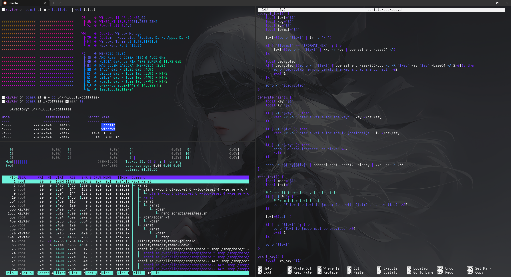

# BX's dotfiles
Configuration files for the tools I use on my Windows 11 PC.

## Requirements
- [Windows Terminal](https://github.com/microsoft/terminal)
- [PowerSehll](https://learn.microsoft.com/es-es/powershell/scripting/overview)
- [Starship](https://starship.rs/)
- [Fastfetch](https://github.com/fastfetch-cli/fastfetch)
- [NerdFonts (Hack Nerd Font)](https://www.nerdfonts.com/)

## Contents
- Starship: Configuration for the terminal prompt, customizing the command line experience.
- Fastfetch: Configuration for the system information tool, displaying OS, hardware, and development environment details.
- Windows Terminal: Settings for appearance, profiles, and keyboard shortcuts.
- PowerShell: Profile script with custom aliases, functions, and startup scripts.

## References
Some repositories I based my configurations on.
- https://github.com/LierB/fastfetch?tab=readme-ov-file
- https://github.com/ChristianLempa/dotfiles-win
- https://github.com/Chick2D/neofetch-themes